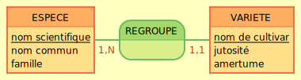

# Correction du jour 1

## MCD

Ton MCD devrait ressembler à ça :

- On peut considérer qu'une famille est une entité à part mais il n'y a rien à stocker de plus que le nom et la liste ne varie jamais, selon Gustave, l'intérêt d'avoir une troisième entité est donc très faible.
- Dans l'interview, il est noté "Une famille regroupe plusieurs espèces et une espèce plusieurs variétés", c'est l'indice qui doit vous mener à cette représentation.
- La liste des propriétés de chaque entité est énoncée dans l'interview, n'en mettez pas plus que celles citées.
- De la même manière, ne créez pas d'autres entités pour gérer ce qui ne l'est pas dans le fichier Excel : l'objectif de l'application, c'est uniquement de remplacer ce système, pas de l'améliorer (on pourra faire ça après).
  - Typiquement, l'interview et l'énoncé mentionnent le fait que les chercheurs sont de nationalités différentes et que certains sont universitaires, d'autres non. Gustave ne mentionne jamais que ces infos sont dans le fichier, on part du principe qu'elles n'y sont pas et que les variétés ne sont pas associées à un chercheur qui les aurait découvertes ou à un pays ou une université particulier.
  - De même, la discussion de fin sur l'hybridation qui part dans la génétique était un piège. Il arrive fréquemment que la discussion avec un client "dérape", n'hésitez pas à ce moment-là à demander si ça a quelque chose à voir avec le projet (pas de façon trop brute pour éviter de le vexer, mais en précisant que c'est pour vous aider à délimiter l'application).
- Il manquait volontairement l'information de l'utilité de ce fichier, qui peut être cruciale pour mieux comprendre ce qui doit ou ne doit pas y figurer et pourquoi. Ici, cette liste de variété est certainement destinée à générer un catalogue pour les plantations afin qu'elles puissent commander ce qui les intéresse. Il est donc tout à fait normal que des notions de RH comme la liste des chercheurs, ou des notions de génétique avancée comme celles d'ADN, d'allèles dominants etc. n'y figurent pas.

## MPD

Vous pouviez vous aider du fichier data.sql fourni et n'ajouter que le DDL. Voici [une version](./jour1.sql) permettant de tout créer d'un coup, tables et données.

Si vous voulez repartir de cette version, il ne vous reste qu'à créer un utilisateur dédié et sa base, puis à importer le script **en utilisant ce nouveau rôle créé** (sinon les tables appartiendront à postgres et vous aurez des problèmes de privilèges) :
- depuis n'importe quelle base, avec postgres : `CREATE USER agrumes PASSWORD '123combava';`
- puis `CREATE DATABASE hybridagrume OWNER agrumes;`
- dans pgAdmin, créez un nouveau serveur :
  - nom : Hybrid'agrume (le nom est libre, autant qu'il soit parlant)
  - dans l'onglet Connexion :
    - hôte : `localhost`
    - port `5432` (sauf si vous avez choisi un autre port à l'installation)
    - utilisateur : `agrumes`
    - mot de passe : `123combava`
  - Validez et accédez à la base `hybridagrume` depuis ce "serveur", ouvrez un query tool et copiez/collez le contenu de `jour1.sql` et exécutez, c'est importé !

## UPDATE relatif

Pour passer d'une notation à l'autre, il suffisait ici "d'inverser" les notes, la meilleure devenant la moins bonne et inversement. Pour ça, on peut partir de la meilleure note théorique, 5, et retirer la note actuelle. Si c'est 2, par exemple, 5 - 2 = 3, la nouvelle note est 3. Si c'est 5, 5 - 5 = 0, la nouvelle note est 0. Ca marche à tous les coups, vous pouviez le vérifier facilement en posant les calculs si nécessaire.

Côté SQL, ça se traduisait tout simplement par `UPDATE variety SET bitterness = 5 - bitterness;`

## Bonus

Pas de correction des bonus, car c'est ce qu'on vous demande de faire aujourd'hui.
